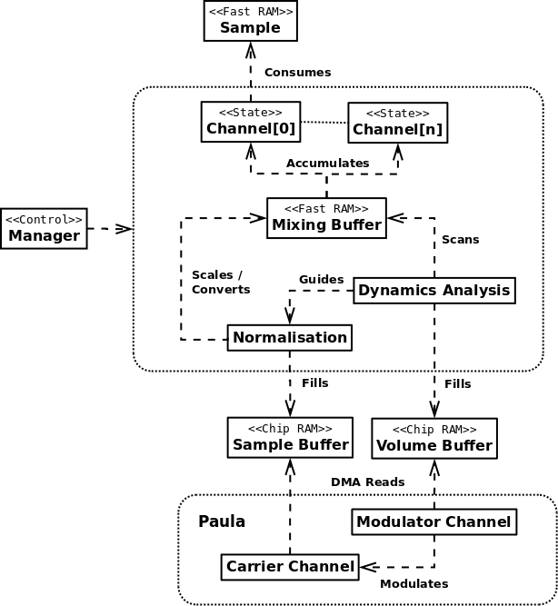
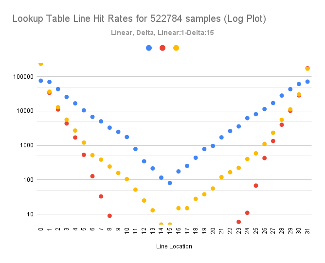

# tkg-mixer
Greenfield Sound Mixer for [AB3D2-TKG](https://github.com/mheyer32/alienbreed3d2)

## About
The purpose of this repository is to experiment design and implement a new sound engine for the game. The original features the same 4 or 8 channel playback mode of the original AB3D game, with the following limitations:
- Fixed 8kHz playback rate.
- 7-bit samples:
    - This allows the 8-channel mode to mix two samples into one channel without the risk of overflow but sacrifices fidelity.
- Single channel mod playback.
    - In practise, this reserves a hardware channel and thus restricts the number of available to either 3 or 8.

The aim is to replace the sound engine with something more sophisticated:
- Customisable rate
    - Mixing/Playback rate
    - Update rate
- 16 fully 8-bit input channels:
    - Independent left and right volume per channel.
    - Scaled and mixed to 16-bit
- Gain Adjusted Paula Playback based on [Paula HDR](https://github.com/0xABADCAFE/paula-hdr)
    - 16-bit mixed data normalised to 8-bit sample + volume data
    - Hardware 8-bit channel volume register is modulated in hardware by a second channel that consumes the volume data.
    - Playback data to be composed of frames of 16 8-bit samples to be played at a given hardware volume.
 - Streamed music:
    - The planned playback method requires all 4 hardware channels, meaning that the module playback is no longer possible.
    - An alternative would be to include a music stream into the mixer. This does not have to be as an existing channel but could be specialised mechanism.

## Design

The overall design is illustrated below:

Overview:

- 8-bit sample data are stored in Fast RAM.
- A set of Channel state structures (one per channel) each maintain:
    - The current pointer to the sample data, or null if no sample is playing
    - The remaining number of samples
    - The left and right volume of the channel in the the stereo field.

- Sound is fetched from the Sample Data into an internal buffer for mixing:
    - This transfer is intended to make use of cache line moves in the 040/060 to avoid polluting the data cache.
    - Depending on the CPU, lookup tables or direct multiplcation is used to scale the 8-bit sample data into a 16-bit intermediate.
    - The 16-bit intermediate data are accumulated into a Mixing Buffer.
 
- Dynamics analysis is performed on the Mixing Buffer. This determines two values:
    - A scale factor for the 16-bit mixed data that permits conversion to 8-bit
    - The ideal hardware channel volume for Paula to replay the 8-bit data at.
    - The resulting sample and volume data are transferred to DMA accessible buffers in Chip RAM.

- Paula is configured to use 2 hardware channels:
    - A carrier channel plays the 8-bit sample data.
    - A second channel is configured to modulate the volume of the carrier and plays the volume data.
    - All 4 channels are be used to permit full stereo output.

- The overall result is that 8-bit samples are mixed without loss of precision into the mixing buffer. The resulting 16-bit stream is then converted into a companded 8-bit format for direct hardware replay by Paula.
- Important points to note regarding hardware volume mdulation:
   - Does not affect the 8-bit DAC precision.
   - Is highly linear, unlike the actual 8-bit DAC itself which has some nonlinearity.
   - Paula accesses data a word at a time:
       - For sample data, this corresponds to a pair
       - When used as a volume modulator, the word comprises a single volume value.
       - This means that when the carrier and modulator are operating at the same frequency, the volume can only be modulated at half the sample rate.
    - The intention is that successive packets of 16 samples will be played at an ideal volume determined for the entire packet.

## Considerations
The game already has quite high system requirements. Consequently, the aim is to design with 68040/68060/Emulation in mind. This section is a bit of a brain dump.

### Concepts
- Frame: A set of 16 sample values that will be processed together, including fetching, normalisation to a given volume, for playback.
- Packet: A number of frames (min 1) that will be processed in a single mixing update operation.
- Line: Any set of data that is aligned to and accessible as a cache line.

### CPU Considerations
| Target | Feature | Implications |
| - | - | - |
| 68040 | 4KiB Datacache | Fast working set |
| 68040 | move16 | Non cache-polluting transfers |
| 68060 | 8KiB Datacache | Fast working set |
| 68060 | move16 | Non cache-polluting transfers |
| 68060 | Fast multiply | Arithemtic can take less time than lookup tables |
| Emu68 | Ludicrous Speed | Anything goes, but identifies as a 68040 |

Considering the above, an ideal implementation should:
- Use move16 to copy source data for mixing to a cached location in the working set.
    - This prevents filling of the data cache with data that won't be immediately reused.
    - There are some caveats around move16 that mean we should have the option of not using it.
-  Prefer multiplication over lookup on 68060 for tasks such as applying volume, normalisation etc.
-  Consider the cache when implementing lookup tables.
    - Scattered access will result in cache misses and line transfers.

### Sound Hardware Considerations
Paula provides 4 channels of 8-bit audio with looping DMA playback from buffers in Chip RAM and provides an interrupt when about to loop. The other key feature it provides is the ability to use channels as a modulation source for volume and/or period of another channel. The mixer will produce 8-bit audio for playback and simultaneously 6-bit volume data in a 16:1 ratio - i.e. 1 volume update per 16 sample points.

In order for the sound to be heard, the mixer has to write the results of mixing into Chip RAM buffers. The Chip RAM bus is 14MHz, 32-bits wide and contended. Writes are therefore extremely slow. The CPU an continue executing instructions while those writes are pending. This means that some of the computational costs can be hidden.

### Cache Considerations
Mixing from multiple input buffers into an output buffer is fundamentally a stream processing task. Naive reading from the source will benefit from cache line transfers giving some readahad but the caches will soon be filled and other data evicted. Both the 68040 and 68060 provide a move16 instrution that can transfer a cache line worth of data from one location to another without allocating any new cache entries. Better use of the cache can be achieved by:
- Having a small, repeatedly used buffer for sample data.
- Transferring data from the source samples to the buffer using move16

Data should be organised in a manner that facilitates cache line transfers:
- Aligned to cache line size (16 bytes)
- Processed in (multiples of) cache line size.

### 68060
For 68060, fast multiplication means that tasks such as converting an 8-bit input sample at a given volume into a 16-bit intermediate for mixing, can be done in entirely the ALU. There is no need for any precoputed tables so the role of the datacache in these operations is not particularly important.

### 68040
For the 68040, multiplication is far more expensive. The use of lookup tables to convert an 8-bit input sample at a given volume into a 16-bit intermediate is unavoidable and therefore the role of cache is much more important.

The most naive implementation would require a 256-entry lookup table of the 16-bit intermediate, per volume level. We have 32 lines that can be hit for a given 8-bit input. In the worst case, each input value in a frame maps to a different line location, resulting in 16 cache line reads during conversion of that frame. However, real audio data tends to be more predictable than this.

A simulation was performed with approximately 512KiB of 8-bit audio in order to assess the hit rate on each line. As expected, the first and last lines of the table had the highest hit rates (the entries beyond index 128 correspond to negative values, approaching -1 for index 255):

 | Line |  Access | Hit % |
 | - | - | - |
 |    0 |   76389 | 14.61 |
 |    1 |   70581 | 13.50 |
 |    2 |   43585 |  8.34 |
 |    3 |   25762 |  4.93 |
 |    4 |   16787 |  3.21 |
 |    5 |   10519 |  2.01 |
 |    6 |    6788 |  1.30 |
 | ... | ... | < 1 % |
 |   24 |    6228 |  1.19 |
 |   25 |    8125 |  1.55 |
 |   26 |   11435 |  2.19 |
 |   27 |   17149 |  3.28 |
 |   28 |   28256 |  5.40 |
 |   29 |   43274 |  8.28 |
 |   30 |   61325 | 11.73 |
 |   31 |   71899 | 13.75 |

This access pattern is still not ideal, given that there will be up to 16 frames to mix and each frame having independent left and right volumes. We only have 4KiB of data cache. To address this, one obvious solution is to first convert the 8-bit sample into a difference from the previous one. This delta value can then be looked up instead and the resulting 16-bit value considered as a delta to be added to a running 16-bit value for the frame. Doing this results in significantly improved hit rates on the first lines:

 | Line |  Access | Hit % |
 | - | - | - |
 |    0 |  249939 | 47.81 |
 |    1 |   34017 |  6.51 |
 |    2 |   11089 |  2.12 |
 | ... | ... | < 1 % |
  |   29 |   10186 |  1.95 |
 |   30 |   28590 |  5.47 |
 |   31 |  176334 | 33.73 |

Implementing this delta mechanism across frames presents a number of complexities that it would be nice to avoid. Conversely, a variant in which the first lookup is linear and the subsequent 15 are delta was also simulated:

 | Line |  Access | Hit % |
 | - | - | - |
 |    0 |  238106 | 45.55 |
 |    1 |   36702 |  7.02 |
 |    2 |   12922 |  2.47 |
 |    3 |    5635 |  1.08 |
 | ... | ... | < 1 % |
 |   28 |    5570 |  1.07 |
 |   29 |   12210 |  2.34 |
 |   30 |   30481 |  5.83 |
 |   31 |  170615 | 32.64 |

This is still significantly better than the linear case. For completeness, a plot of hit rates for each method on all 32 lines is shown below. Note the Y axis is log scaled in order to better visualise the differences.

The performance of the cache could be improved by storing only the positive values in these tables, halving the storage required. However, this needs to be weighed against the cost of dealing with the sign handling.
